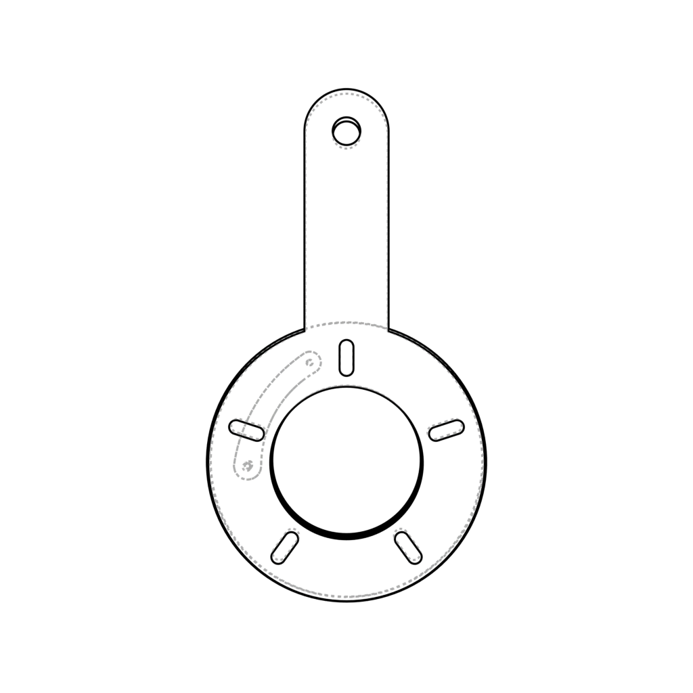
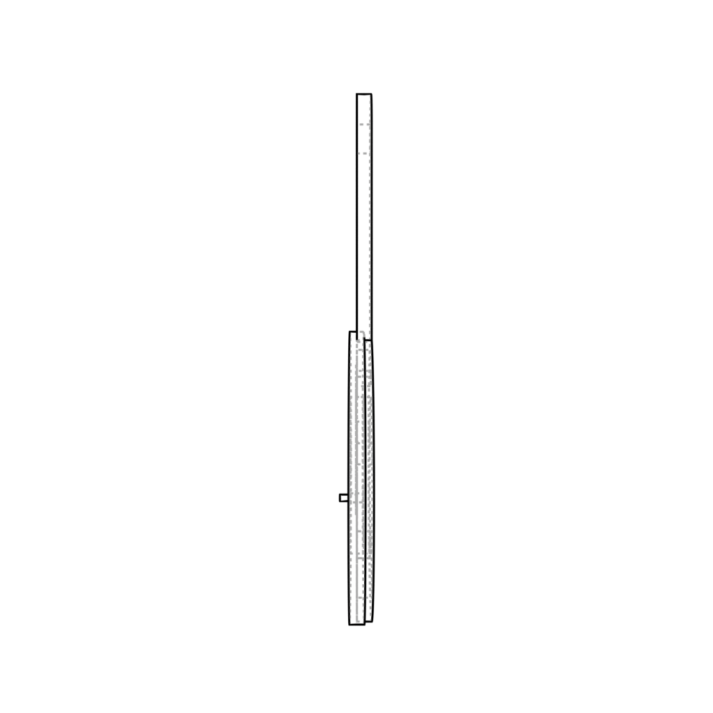
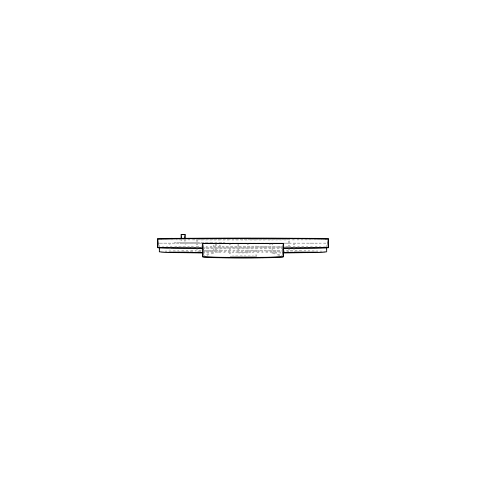

# Render 3D model to multi-view images (or contours/sketches) with blender

## Usage

Recommend poetry to manage python environment.

```bash
poetry install
```

Or use pip to install dependencies. Need python 3.10 (>=3.10,<3.11.dev0)

```bash
pip install bpy numpy fire loguru
```

```bash
# randomly rendering
python run_render.py --object_path <path/to/file> --output_dir <path/to/output/dir> --num_renders 12 --num_trials 1

# three views figure rendering
python run_render.py --object_path <path/to/file> --output_dir <path/to/output/dir> --three_views --freestyle
```

Add `--freestyle` flag to render contours/sketches.

Add `--only_northern_hemisphere` flag to locate camera only northern hemisphere.

This program will render `num_renders × num_trials` images. While `num_trials` not `1`, the camera will be placed at `0, 45, 90, 135, 180` degrees azimuth and randomly perturbed to render num_renders images. Otherwise, the camera will be randomly placed from the 0 to 360 degrees azimuth.

When rendering three views figure, the camera will be placed at `(0, 0)`, `(0, 90)` and `(90, 0)` degrees azimuth and randomly perturbed to render num_renders images. By default, the program will render the hidden edges as dashed lines. If you want to only render the visible edges, please add `--visible_edge` flag.

Here are samples of three views figure rendering.
Front view:



Side view:



Top view:



Code partially borrowed (scene normalization, camera/light setup and metadata extractor) from [Objaverse-XL](https://github.com/allenai/objaverse-xl/tree/main/scripts/rendering).

## Use as a library

```python
from image_render import Renderer

renderer = Renderer()
renderer.render_object("sample_data/sample_from_abc.stl", "sample_output", three_views=True)
```
